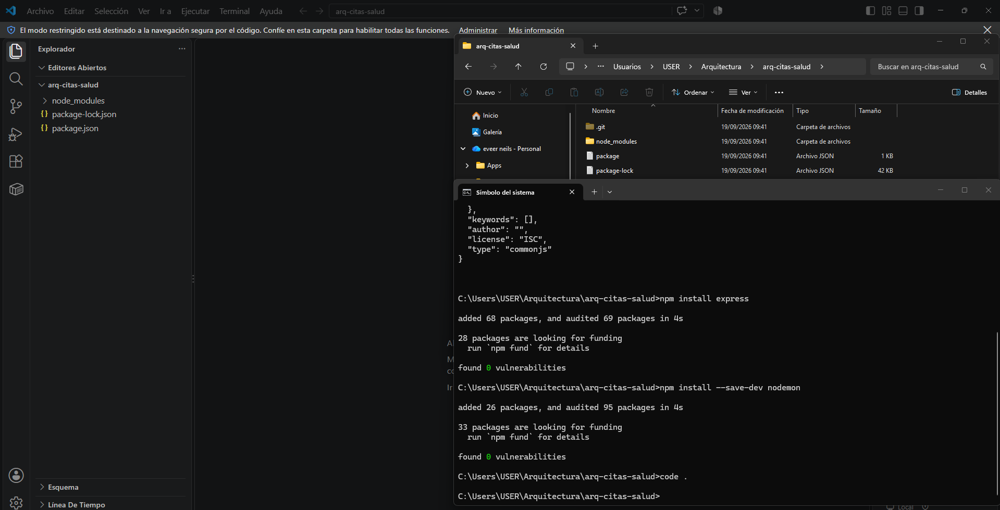
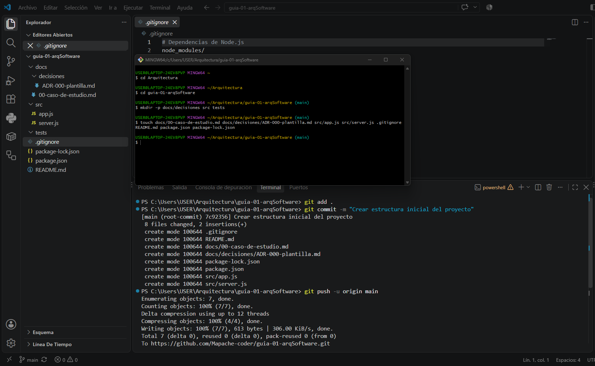

• Nombre completo del estudiante. CHIPANA NUÑEZ EVER NEILS

• Una breve descripción del curso.
Fundamentos de la Arquitectura de Software. Definiciones específicas y detalladas del arquitecto y la arquitectura de software. Estilos de arquitectura. Patrones de diseño y patrones de arquitectura de aplicaciones; diseño y atributos de calidad de la arquitectura de software; documentación de la arquitectura mediante modelo de vistas y modelo C4. Arquitectura basada en servicios: REST, microservicios y otros enfoques. Gestión de cambios, auditoría y seguridad. Control de versiones. Despliegue y administración de aplicaciones en ambientes locales y servicios de nube. La asignatura integra teoría y laboratorio mediante un proyecto incremental en el que el estudiante analiza requisitos y drivers arquitectónicos, diseña, documenta, implementa parcialmente y despliega una solución web, justificando decisiones arquitectónicas con criterios de calidad, mantenibilidad, escalabilidad, seguridad e interoperabilidad. 

• Expectativas del estudiante respecto al curso.
 Poder diseñar y evalúar soluciones de software con pensamiento crítico y sistémico,  aplicando principios de ingeniería, buenas prácticas, comunicación técnica, trabajo colaborativo, ética profesional y orientación a la calidad y a las necesidades de los usuarios.

• Nombre completo del docente.
Ing. Lizbeth Jaico Quispe

• Además incluir la captura de imágenes del paso 1 y paso 2
## Capturas de pantalla

**Paso 1:**

**Paso 2:**
